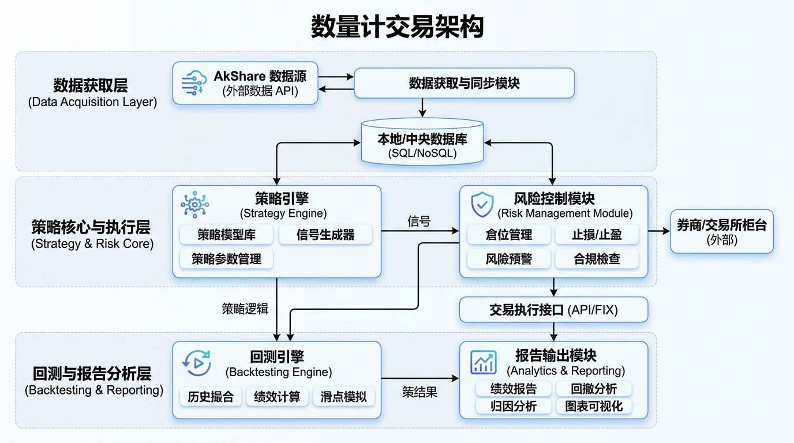
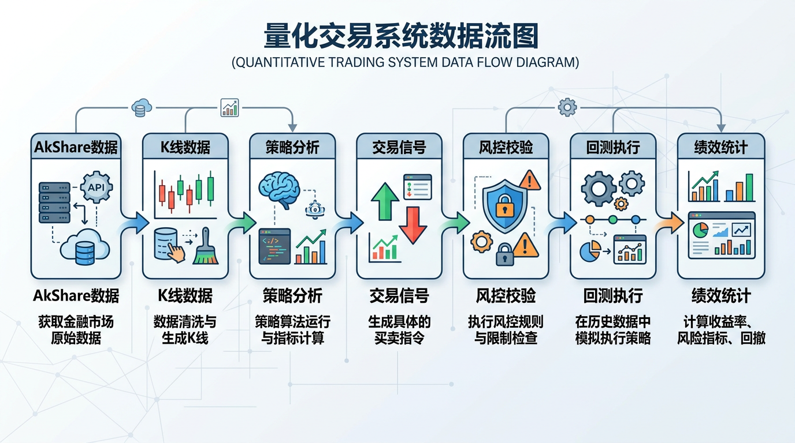

# 架构全景



## 系统组件

| 组件 | 职责 | 入口文件 |
|------|------|----------|
| 数据获取 | 从 AkShare/CSV/模拟获取期货数据 | backtest_runner.py |
| 策略引擎 | Price Action 分析、信号生成 | china_futures_strategy.py |
| 风控模块 | 止损止盈计算、仓位管理 | risk.py |
| 回测引擎 | 历史数据模拟交易、绩效统计 | backtest.py |
| 技术指标 | ATR/均线/布林带等零依赖实现 | indicators.py |
| 形态识别 | K线形态检测（Pin Bar/吞没等） | patterns.py |

## 模块划分

```
quant/
├── china_futures_strategy.py   # 策略入口，品种配置，交易时段
├── backtest_runner.py          # 回测运行器，支持多数据源
├── backtest.py                # 回测引擎核心
├── strategy.py                # 策略抽象基类
├── risk.py                    # 风控和交易执行
├── indicators.py              # 技术指标实现
├── patterns.py                # K线形态检测
├── brooks_concepts.py         # Brooks核心概念
├── price_action_framework.py   # 价格行为框架
└── pyproject.toml             # uv包管理
```

## 数据流



```
AkShare/CSV/模拟数据
       ↓
  K线数据 (dates, opens, highs, lows, closes, volumes)
       ↓
  策略分析 (趋势判断、关键位识别、形态检测)
       ↓
  交易信号 (入场/出场方向、价格、止损止盈)
       ↓
  风控校验 (仓位计算、保证金检查)
       ↓
  回测执行 (模拟成交、持仓管理)
       ↓
  绩效统计 (收益率、胜率、回撤、盈亏比)
```

## 外部集成

- **AkShare futures_zh_daily_sina:** 新浪期货日线数据接口
- **数据格式:** OHLCV 标准格式

## 部署拓扑

单进程 Python 应用，本地运行，无需容器化部署。

---
*最后更新: 2026-04-02 — 初始化生成*