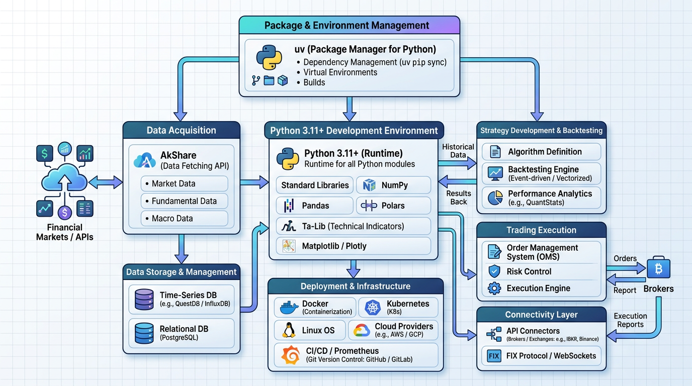

# 项目架构约束

## 技术栈

- **语言:** Python 3.11+
- **数据获取:** AkShare（新浪期货接口）
- **包管理器:** uv
- **依赖库:** 仅 AkShare（生产环境）

## 架构决策

- **目录结构:** 扁平化模块组织，所有模块在根目录
- **分层架构:** 数据层 → 策略层 → 风控层 → 回测层
- **状态管理:** 通过类实例属性管理状态（无外部状态管理）

## API 风格

- **调用方式:** Python 函数/类调用
- **数据格式:** 字典 + 列表（dates, opens, highs, lows, closes, volumes）

## 编码规范

- **命名约定:** snake_case（函数/变量），PascalCase（类）
- **文件组织:** 一功能一文件，模块职责单一

## 部署方式

- **环境:** 本地 Python 环境（.venv）
- **运行:** 命令行执行 backtest_runner.py

## 安全约束

- 模拟交易系统，不涉及真实资金
- 策略仅供学习研究，不构成投资建议

---
*最后更新: 2026-04-02 — 初始化生成*