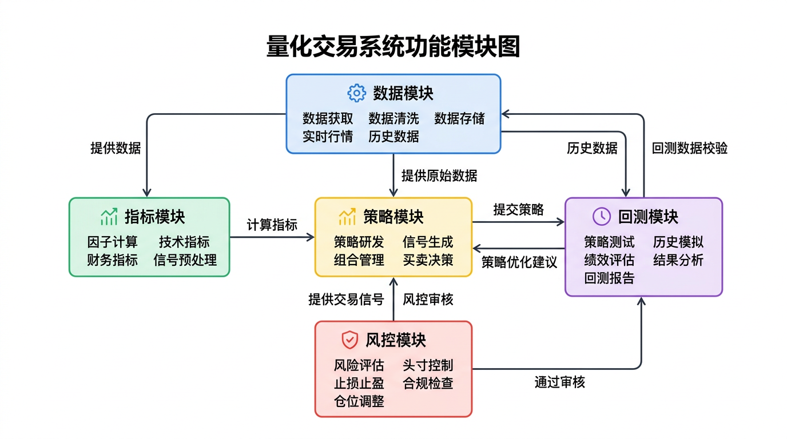

# 已有功能清单

## 策略模块

- **PriceAction策略:** 基于Al Brooks理论的趋势/回调入场
- **趋势判断:** 均线方向 + 结构高低点(HH/HL, LH/LL)
- **关键位识别:** 支撑阻力位、趋势线、供需区
- **入场信号:** Pin Bar、吞没形态、Inside Bar

## 数据模块

- **AkShare数据获取:** 新浪期货日线数据接口
- **CSV导入:** 支持本地CSV文件回测
- **模拟数据:** 内置模拟数据生成器
- **品种配置:** 螺纹钢/铁矿/铜/橡胶等30+品种

## 回测模块

- **顺序回测:** 每根K线后评估
- **事件驱动:** 信号触发即时交易
- **绩效统计:** 收益率/胜率/最大回撤/盈亏比
- **交易记录:** 详细交易清单导出

## 风控模块

- **止损规则:** 2×ATR 移动止损
- **止盈规则:** 4×ATR（2:1盈亏比）
- **仓位计算:** 风险金额 ÷ 止损金额
- **时间止损:** 持仓N根K线无盈利强制平仓

## 指标模块

- **趋势指标:** SMA/EMA/布林带/肯特纳通道
- **波动指标:** ATR
- **强度指标:** ADX/RSI
- **形态工具:** 斐波那契/支撑阻力

---
*最后更新: 2026-04-02 — 初始化生成*