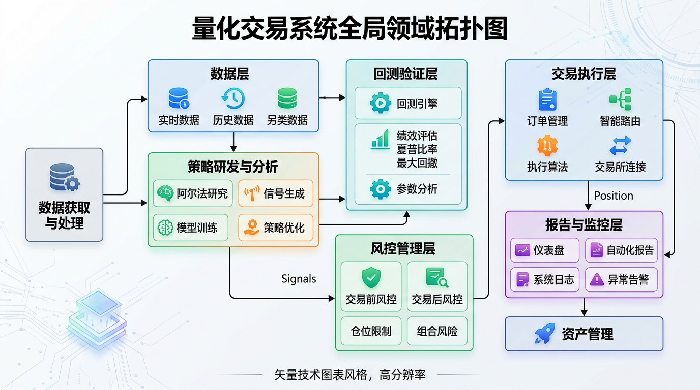

# 项目全局 Spec 索引

## 项目概况

→ [overview.md](./overview.md) — 项目概述
→ [architecture.md](./architecture.md) — 架构全景
→ [features.md](./features.md) — 已有功能清单
→ [constraints.md](./constraints.md) — 架构约束

## 已归档 Feature

| Feature ID | 摘要 | 领域 | 归档日期 |
|-----------|------|------|----------|
| [feature_20260402_F001_multi-symbol-intraday](../archive/feature_20260402_F001_multi-symbol-intraday/) | 多品种日内交易，支持33个期货品种的波动性筛选和批量回测 | quant-trading | 2026-04-02 |

## 领域索引

- [quant-trading](./domains/quant-trading.md) — 量化交易（1 feature）

---
*最后更新: 2026-04-02 — 由 feature_20260402_F001_multi-symbol-intraday 归档时更新*
