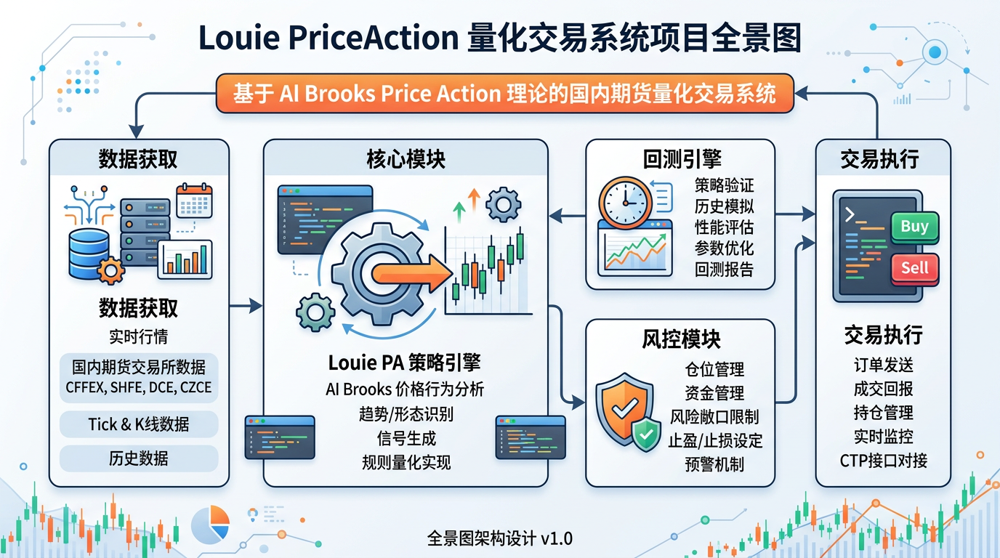

# 项目概述

## 项目目标

Louie PriceAction 量化交易系统是一个基于 **Al Brooks Price Action** 和 **Brooks Trading Course** 理论的纯 Python 量化交易系统，专为国内期货市场设计。系统通过分析 K 线形态、趋势结构和价格行为生成交易信号，不依赖任何技术指标。

## 核心用户

- 量化交易研究者
- 个人投资者
- 期货交易学习者

## 系统边界

- **AkShare 数据源:** 获取国内期货实时和历史行情数据（东方财富/新浪期货）
- **CSV 文件:** 支持本地 CSV 文件导入进行回测
- **模拟数据:** 内置模拟数据生成器用于演示和测试

## 核心业务流程

1. **数据获取:** 从 AkShare 或 CSV 获取期货品种的 OHLCV 数据
2. **策略分析:** 使用 Price Action 理论分析价格结构、识别趋势、判断入场时机
3. **信号生成:** 结合风控规则计算入场价、止损价、止盈价
4. **回测验证:** 在历史数据上模拟交易，评估策略绩效
5. **结果输出:** 生成详细的回测报告（收益率、胜率、最大回撤等）

---
*最后更新: 2026-04-02 — 初始化生成*